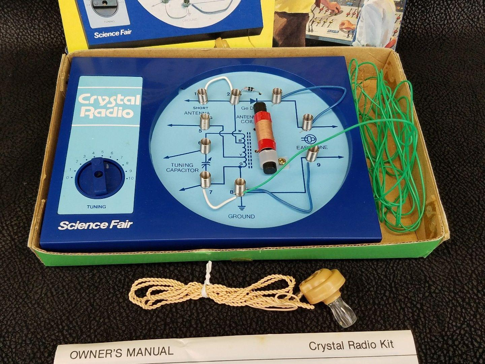

Pi Pico Rx - A crystal radio for the digital age?
=================================


My first step into the world of electronics was with a crystal radio, just like this one. 



Back then, I don't think it has ever occurred to me that I could make a radio myself, so I wasn't expecting it to work. But when I put the earphone in, I was amazed to hear very faint sounds coming through. I couldn't believe that building a radio could be so simple, and the best part was, it didn't need any batteries! That little experience sparked my interest in electronics.

Times have certainly changed since then, and today, we find ourselves in a golden age for electronics enthusiasts. Back in the ninteen eightees, I could have never imagined that my pocket money would one day buy a device with computing power that could have filled an entire room just a few decades ago.

I often wonder how we can still capture that sense of awe and excitement from my first crystal radio experience. Is it still possible to create something simple yet captivating? 

The Pi Pico Rx - may be the answer to that question. While it may not be quite as straightforward as the crystal radio, the Pi Pico Rx presents a remarkably simple solution. Armed with just a [Raspberry Pi Pico](https://www.raspberrypi.com/products/raspberry-pi-pico/), an analogue switch, and an op-amp, we now have the power to construct a capable SDR receiver covering the LW, MW, and SW bands. With the ability to receive signals from halfway around the globe. I can't help but think that my younger self would have been truly impressed!


Features
--------

+ 0 - 30MHz coverage
+ 250kHz bandwidth SDR reciever
+ CW/SSB/AM/FM reception
+ OLED display
+ simple spectrum scope
+ Headphones/Speaker
+ 500 general purpose memories
+ runs on 3 AAA batteries
+ less than 50mA current consumption

Development
-----------


Pi Pico Rx is currently at the experimental prototyping stage, but it does work. [Read the Docs](https://101-things.readthedocs.io/en/latest/radio_receiver.html) for more technical details!

Getting the Code
----------------

You can find a precompiled binary for PiPicoRx [here](https://github.com/dawsonjon/PicoRX/actions?query=is%3Acompleted). If you want to build from the C++ source files, follow these instructions.

```
  sudo apt install git
  git clone https://github.com/dawsonjon/PicoRX.git
  cd PicoRX
  git submodule init
  git submodule update
```


Install Pi Pico SDK
-------------------

Follow the `Getting started with the Raspberry Pi Pico <https://datasheets.raspberrypi.com/pico/getting-started-with-pico.pdf>`_ quick start guide to install the C/C++ SDK.

```
  sudo apt install wget #if wget not installed
  wget https://raw.githubusercontent.com/raspberrypi/pico-setup/master/pico_setup.sh
  chmod +x pico_setup.sh
  ./pico_setup.sh
```

For windows users, this page provides and [installer](https://www.raspberrypi.com/news/raspberry-pi-pico-windows-installer/) that makes the process much simpler.
  

Build Projects
--------------

```
  mkdir build
  cd build
  cmake -DPICO_BOARD=pico -DPICO_SDK_PATH=~/pico/pico-sdk ..
  make
```

```
  mkdir build
  cd build
  cmake -DPICO_SDK_PATH=~/pico/pico-sdk -DPICO_BOARD=pico2 -DPICO_PLATFORM=rp2350-arm-s ..
  make
```

```
  mkdir build
  cd build
  cmake -DPICO_SDK_PATH=~/pico/pico-sdk -DPICO_BOARD=pico2 -DPICO_PLATFORM=rp2350-riscv ..
  make
```

Credits
-------

Massive thanks to everybody who has contributed and given feedback on this project. Thanks to
all your efforts, we’re closer than ever to making radio more accessible,
innovative, and community-driven.

The project uses the Universal 8-bit Graphics Library (u8g2) library by
olikraus@gmail.com, the pico_ssd1306 display library by David Schramm and the
ILI934X display driver by Darren Horrocks.

Special Thanks to:

Mariusz Ryndzionek for contributing IQ Imbalance Correction, De-emphasis
filter, USB audio, U8G2 integration, Synronous AM Demodulation and many other
enhancements.

Penfold42 for Gain Calibration, Frequency Scanning, Spectrum Zoom, Multiple home screen
views, Animated Splash Screen, Support for multiple displays/configurations and
many other enhancements.

Robert Nickels (W9RAN) and Jim Reagan (W0CHL) for their support and
encouragements and for the enormous effort they have both put in testing,
debugging, feedback and suggestions.

